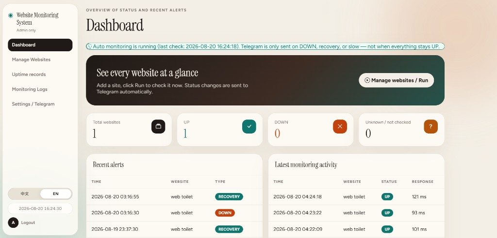
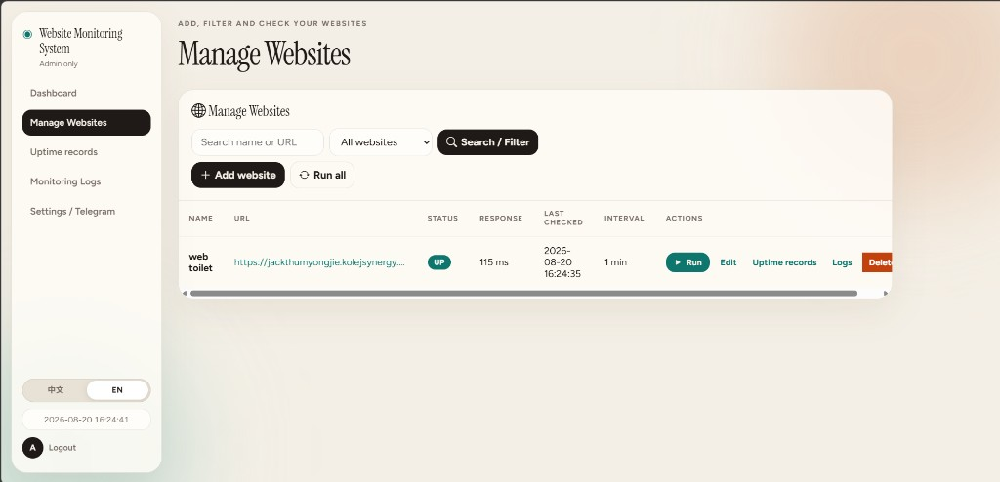
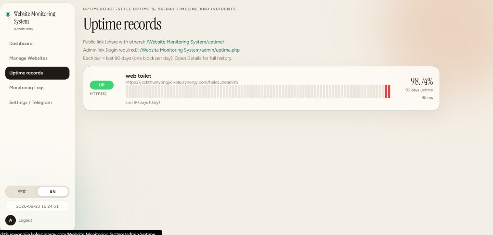
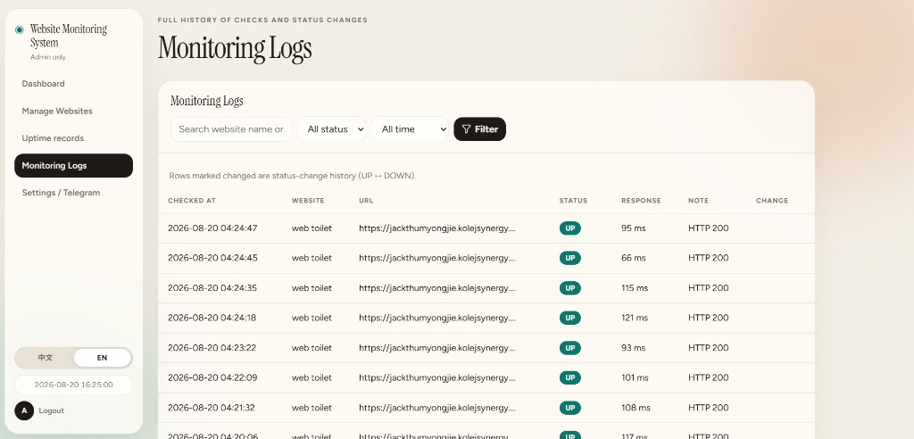
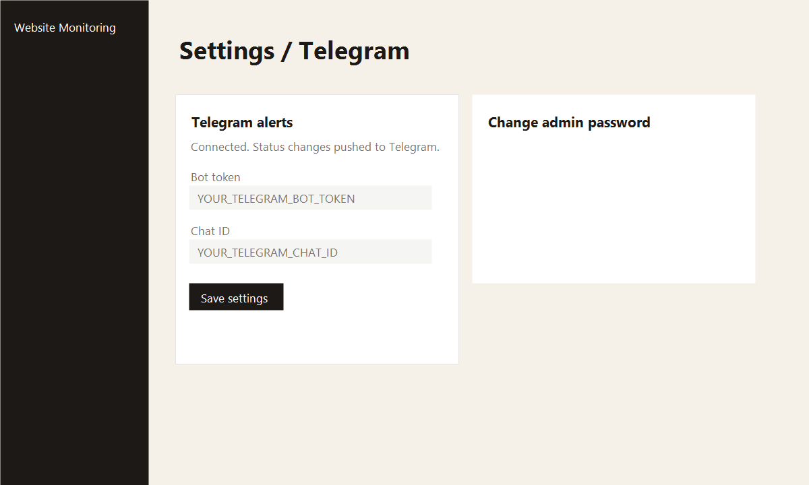

# Website Monitoring System

Admin-only website uptime monitor built with **PHP + MySQL**. Checks HTTP availability on a schedule, stores logs, and sends **Telegram** alerts when status changes (DOWN, recovery, or slow).



## Features

- Secure admin login (sessions + password hashing)
- Add, edit, delete monitored websites (name, URL, interval)
- Dashboard: totals, UP/DOWN counts, recent alerts, latest checks
- Monitoring logs with status-change markers
- Public uptime page (90-day timeline, UptimeRobot-style)
- Cron engine: HTTP checks, response time, slow detection
- Telegram: alerts on DOWN, recovery UP, and slow (no repeat spam while status unchanged)
- English default UI (switch to 中文 in the sidebar)

## Screenshots

| Dashboard | Manage Websites |
|-----------|-----------------|
|  |  |

| Uptime records | Monitoring Logs | Settings |
|----------------|-----------------|----------|
|  |  |  |

## Security (before publishing to Git)

- Do **not** commit `config/config.php` or `config/database.php` (listed in `.gitignore`).
- Use `config.example.php` and `database.example.php` as templates only.
- Never put real passwords, Telegram tokens, or cron secrets in README or SQL dumps.
- Change admin password, `RESET_CODE`, and database password after deployment.

## Quick start

```bash
cp config/config.example.php config/config.php
cp config/database.example.php config/database.php
# Edit both files with your values
```

### XAMPP (local)

1. Start Apache and MySQL.
2. Open `install.php` in the browser, or import `database/schema.sql`.
3. Default local DB in `database.example.php`: `website_monitor`, user `root`, empty password.
4. Log in, **change the admin password immediately**, then delete `install.php`.

### Telegram

1. Create a bot with [@BotFather](https://t.me/BotFather).
2. Get your Chat ID via `getUpdates`.
3. Admin → **Settings / Telegram** → save token and chat ID → send test message.

### Cron (automatic checks)

- **Windows**: double-click `start-cron.bat` (keep the window open).
- **Linux / cPanel**: run `cron/monitor.php` or `cron/web-cron.php` every minute. See `cron/crontab.example` and `cron/cpanel-cron.txt` (use your own URL).

## Project structure

```
config/config.example.php    Config template (safe to commit)
config/database.example.php  Database template (safe to commit)
includes/monitor.php         Monitoring engine
includes/telegram.php        Telegram notifications
cron/monitor.php             Cron entry point
admin/                       Admin UI
uptime/                      Public status page
database/schema.sql          Table structure (no secrets)
docs/images/                 README screenshots
LICENSE                      MIT License
```

## Status rules

| Status | Meaning |
|--------|---------|
| UP | HTTP 2xx–3xx |
| DOWN | Timeout, connection error, or HTTP ≥ 400 |
| SLOW | UP but response time above threshold |

## Requirements

- PHP 7.4+ with **curl** extension
- MySQL 5.7+ / MariaDB

## License

MIT License — see [LICENSE](LICENSE).

## Language

Default language is **English**. Use the **中文 / EN** switcher in the sidebar to change language.
